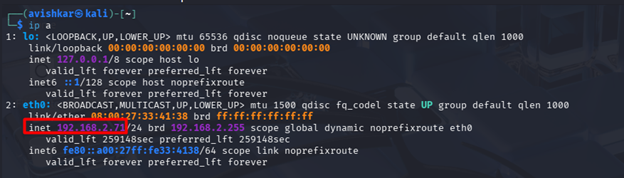
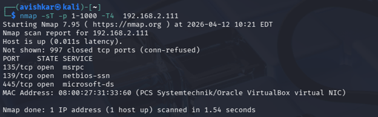
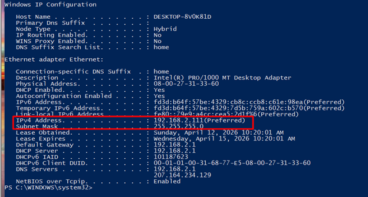
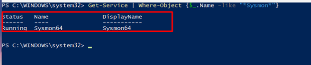
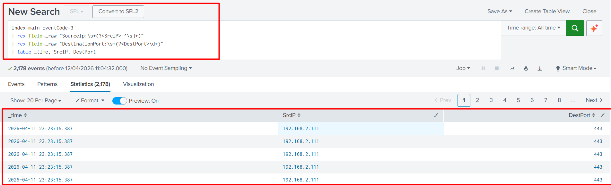
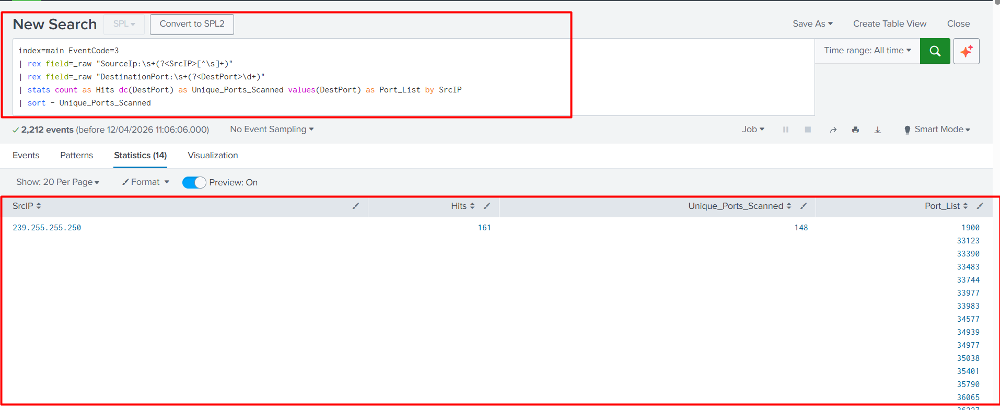
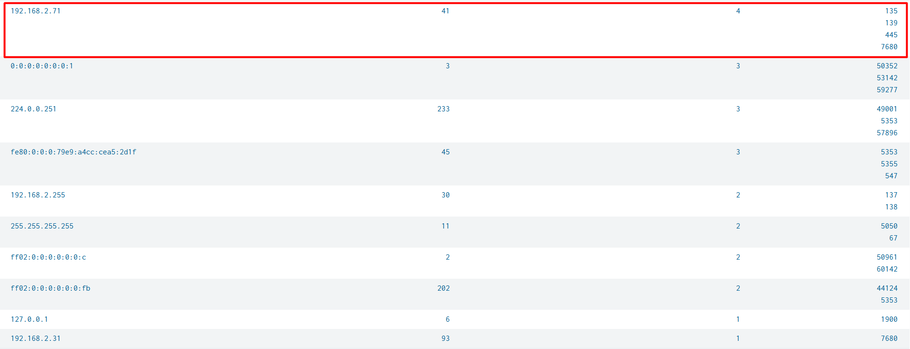
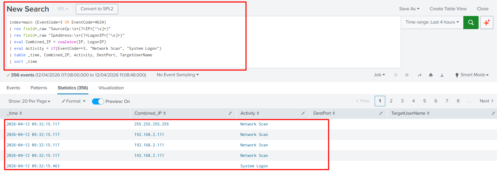
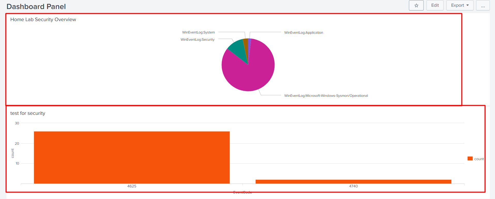

# Windows Brute Force Detection Lab: Sysmon & Splunk

## Project Overview
This project demonstrates the setup of a telemetry pipeline from a Windows 10 VM to a Splunk SIEM. I simulated a network reconnaissance attack and built custom dashboards to identify and correlate adversary activity.

## Lab Steps 
### 1. Attacker Identification
**What:** I identified the Kali Linux IP using `ip a`.
**Why:** To establish a "Known Bad" IP for tracking throughout the lab.

### 2. Network Reconnaissance
**What:** Performed a TCP Connect scan using `nmap -sT`.
**Why:** To simulate the initial phase of an attack and generate network telemetry (Event ID 3).

### 3. Sysmon Service Audit
**What:** Verified Sysmon status using `Get-Service`.
**Why:** To ensure the endpoint sensor was active and capturing granular event data.

### 4. Data Ingestion in Splunk
**What:** Visualized log counts by sourcetype.
**Why:** To confirm that the Universal Forwarder is successfully sending Sysmon and Security logs.

### 5. Custom Field Extraction
**What:** Used the `rex` command to parse raw logs.
**Why:** To extract IP addresses and Ports into searchable fields, proving technical SIEM engineering skills.

### 6. Detection Dashboard
**What:** Created a summary table of the Nmap scan.
**Why:** To provide an analyst with a clear view of which ports were targeted by the attacker.

### 7. Adversary Correlation
**What:** Linked network events (ID 3) with logon events (ID 4624).
**Why:** This proves the "Smoking Gun"—the attacker moved from scanning to a successful system login.

### 8. Final SOC Overview
**What:** A consolidated Master Dashboard.
**Why:** To demonstrate the ability to build a "Single Pane of Glass" for real-time security monitoring.

---

## Conclusion
This lab successfully mapped the "Reconnaissance" and "Initial Access" stages of the Cyber Kill Chain. It proves proficiency in endpoint monitoring, SIEM engineering, and log correlation.
